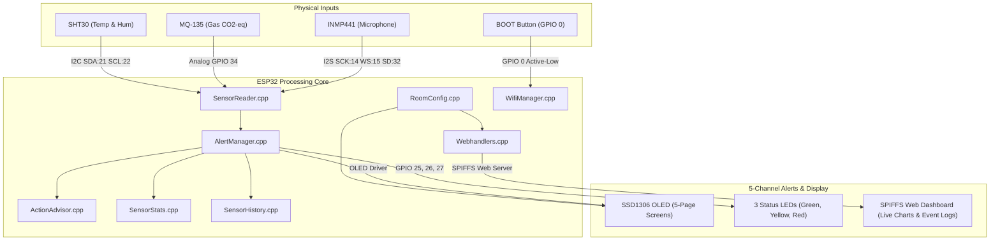

<h1 align="center">🍃 AtmosSense</h1>

<p align="center">
  
</p>

<p align="center">
  <a href="https://platformio.org/"></a>
  <a href="https://www.espressif.com/en/products/socs/esp32"></a>
  <a href="https://isocpp.org/"></a>
  
  
</p>

AtmosSense is a **fully self-hosted, local-only, zero-cloud indoor environmental comfort monitor** built on the ESP32. It continuously samples temperature, relative humidity, air quality (CO2-equivalent), and sound levels (noise SPL), delivering actionable safety instructions through multiple channels.

No cloud servers. No subscriptions. No proprietary mobile apps. Open any browser on your local Wi-Fi network to view a real-time responsive dashboard served directly from the ESP32's flash storage.

## 📸 System Architecture

The following diagram details how physical sensor data is processed by the ESP32 firmware modules and dispatched to output channels.



## 🔌 Hardware Connections & Pinout

AtmosSense utilizes a variety of analog and digital communication protocols (I2C, I2S, Analog, Digital GPIO) to coordinate sensors and outputs.

| Component | Interface | ESP32 GPIO | Description |
| :--- | :--- | :--- | :--- |
| **SHT30 Sensor** | I2C | SDA `21`, SCL `22` | Digital temperature & relative humidity sensor. |
| **MQ-135 Sensor** | Analog | Pin `34` | Gas sensor mapped to CO2-equivalent Air Quality. |
| **INMP441 Sensor** | I2S | SCK `14`, WS `15`, SD `32` | Digital omnidirectional microphone for noise monitoring. |
| **SSD1306 OLED** | I2C | SDA `21`, SCL `22` | 128×64 physical interface (shares I2C bus). |
| **Status LEDs** | Digital | Green `25`, Yellow `26`, Red `27` | Direct GPIO driven visual indicator. |
| **BOOT Button** | Digital | Pin `0` | Physical button. Hold 3s on boot to clear Wi-Fi configs. |

## ⚠️ Comfort Zones, Thresholds & Advisor Rules

AtmosSense goes beyond raw numbers. When thresholds are breached, the device acts as a digital health assistant. The built-in rule engine in [`src/ActionAdvisor.cpp`](src/ActionAdvisor.cpp) generates precise instructions based on human comfort guidelines.

### Threshold Boundaries

> [!IMPORTANT]
> The thresholds below are hardcoded comfort zones tailored for healthy indoor environments.

*   **Temperature (Feels-Like Heat Index)**
    *   **Safe**: 20.0°C – 28.0°C
    *   **Warning**: 16.0°C–20.0°C / 28.0°C–32.0°C
    *   **Danger**: < 16.0°C or > 32.0°C
*   **Humidity (RH%)**
    *   **Safe**: 40% – 60%
    *   **Warning**: 30%–40% / 60%–70%
    *   **Danger**: < 30% or > 70%
*   **Air Quality (CO2-equivalent ppm)**
    *   **Safe**: < 800 ppm
    *   **Warning**: 800 ppm – 1200 ppm
    *   **Danger**: > 1200 ppm (Evacuate if extreme > 5000 ppm)
*   **Noise Level (dB SPL)**
    *   **Safe**: < 70 dB
    *   **Warning**: 70 dB – 95 dB
    *   **Danger**: > 95 dB

### Actionable Advice Matrix

| Sensor Type | Active Alert State | Actionable Advice | Rationale / Risk |
| :--- | :--- | :--- | :--- |
| **Temperature** | ❄️ Dangerously Cold | Add layers, use a heater, avoid prolonged exposure. | Risk of hypothermia. Core body temperature may drop. |
| | 🧊 Cold Room | Wear warm clothing or turn on a heater. | Exposure below 20°C reduces immunity. |
| | ☀️ Warm | Drink water regularly and ensure airflow. | Approaching uncomfortable heat limits. |
| | 🔥 Heat Stress Risk | Turn on AC or fan immediately. Drink water. | Conditions above 32°C can cause heat exhaustion. |
| **Humidity** | 🏜️ Critically Dry | Use a humidifier immediately. Drink more water. | Severe dryness damages respiratory tract & skin. |
| | 💧 Critically Humid | Open windows, run dehumidifier/exhaust fan now. | Promotes rapid mold growth & respiratory issues. |
| **Air Quality**| ⚠️ Poor Air Quality | Open a window or turn on ventilation. | Elevated CO2 reduces focus and causes fatigue. |
| | 🚨 Dangerous Air | Open all windows & doors. Identify source. | Above 1200 ppm causes headaches & dizziness. |
| | ☣️ Evacuate | Leave the room now. Do not re-enter. | Extremely dangerous. Risk of unconsciousness. |
| **Noise Level**| 🔊 Elevated Noise | Consider reducing background noise. | Above 70 dB is distracting and tiring. |
| | 📢 High Noise | Reduce noise sources or limit exposure. | Risk of hearing damage on prolonged exposure. |
| | 🧨 Dangerous Noise | Leave the area or use ear protection. | Above 95 dB causes permanent hearing damage. |

## 📂 Firmware & Web Assets

The firmware codebase is divided into modular, decoupled files to allow easy component swapping:

*   [`src/main.cpp`](src/main.cpp): System initialization, setup routines, and execution loop.
*   [`src/SensorReader.cpp`](src/SensorReader.cpp) / [`include/SensorReader.h`](include/SensorReader.h): Controls data acquisition from I2C (SHT30), Analog (MQ-135), and I2S (INMP441).
*   [`src/AlertManager.cpp`](src/AlertManager.cpp) / [`include/AlertManager.h`](include/AlertManager.h): Evaluates comfort zones and manages the state of the 3 physical alert LEDs.
*   [`src/ActionAdvisor.cpp`](src/ActionAdvisor.cpp) / [`include/ActionAdvisor.h`](include/ActionAdvisor.h): Translates threshold levels into user actionable advice.
*   [`src/OledDisplay.cpp`](src/OledDisplay.cpp) / [`include/OledDisplay.h`](include/OledDisplay.h): Manages physical SSD1306 pages (Overview, Temp, Humidity, Air Quality, Noise, System Info).
*   [`src/WifiManager.cpp`](src/WifiManager.cpp) / [`include/WifiManager.h`](include/WifiManager.h): Configures the ESP32 Wi-Fi in AP/STA mode. Supports a fallback captive portal for local setup.
*   [`src/Webhandlers.cpp`](src/Webhandlers.cpp) / [`include/WebHandlers.h`](include/WebHandlers.h): REST endpoints providing real-time JSON updates (`/api/stats`, `/api/history`, `/api/room`) to the web browser.
*   [`data/`](data/): The raw web assets hosted on ESP32 SPIFFS filesystem:
    *   [`dashboard.html`](data/dashboard.html): Structure of the responsive monitor page.
    *   [`dashboard.css`](data/dashboard.css): Beautiful custom styles (dark-mode comfort layout).
    *   [`dashboard.js`](data/dashboard.js): Web sockets, API polling, alerts browser notifications, and charts rendering.

## 🛠️ Building & Uploading Firmware

This project uses [PlatformIO](https://platformio.org/) for compilation.

### 1. Requirements
*   VS Code with the **PlatformIO IDE** extension installed.
*   Or the **PlatformIO Core CLI** tool.

### 2. Compilation and Uploading
Connect your ESP32 dev board to your computer via USB and execute the following commands in the project directory:

```bash
# 1. Build the firmware binary
pio run

# 2. Upload the firmware to ESP32
pio run -t upload

# 3. Upload web interface files (SPIFFS dashboard assets)
pio run -t uploadfs

# 4. Open Serial Monitor (115200 baud) to view logs
pio device monitor
```

## 👥 Team SENSEible

*   **Barnik Chakraborty**
*   **Soumya Adhikari**
*   **Ranit Pramanik**
*   **Soumik Samanta**

